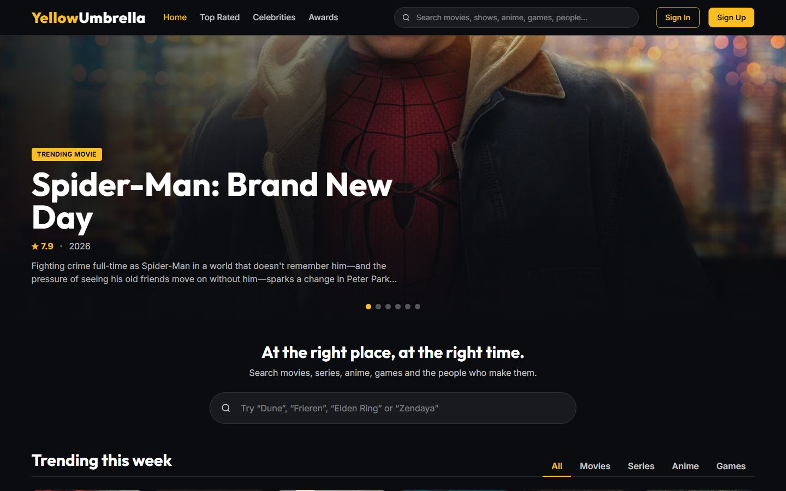
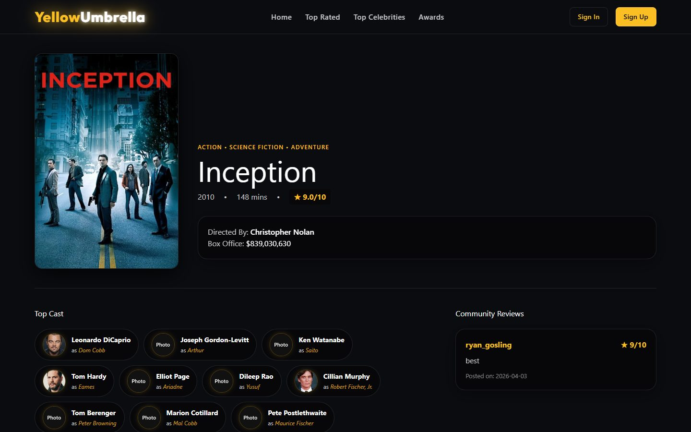
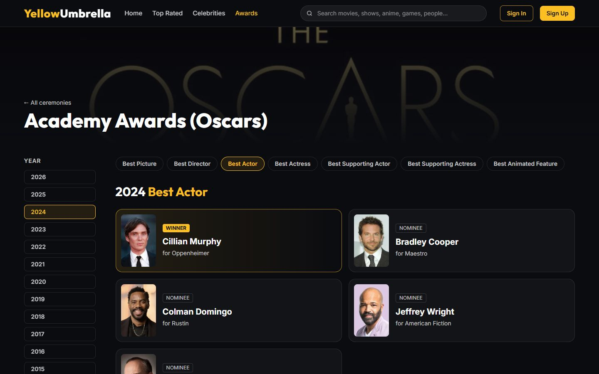
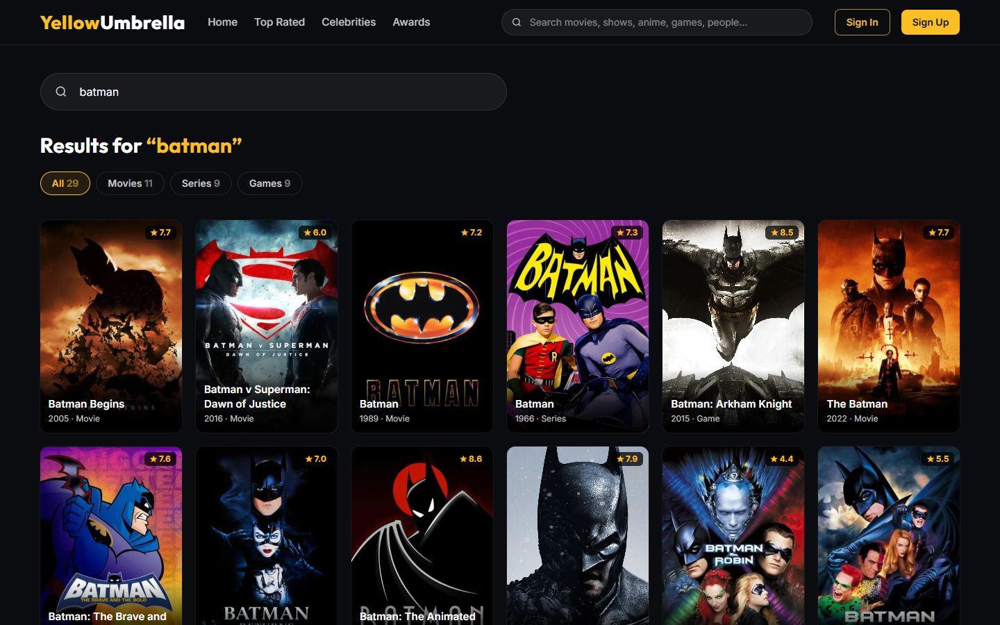
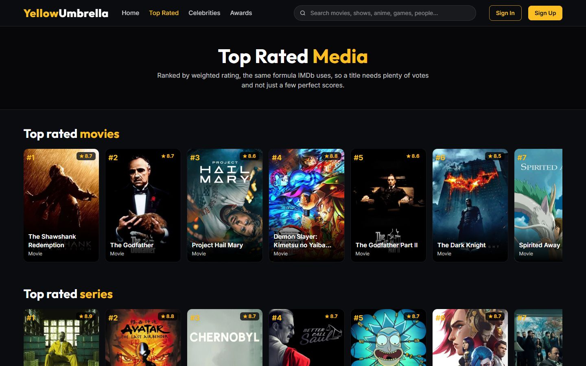
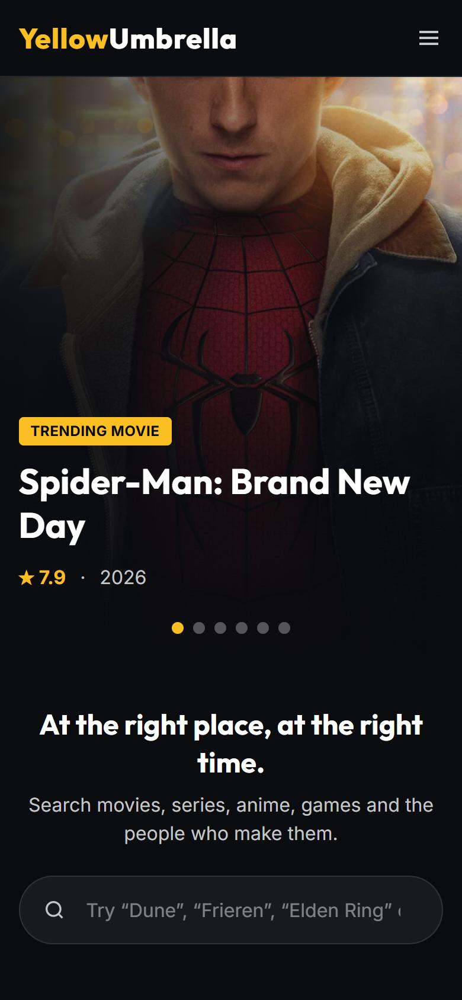
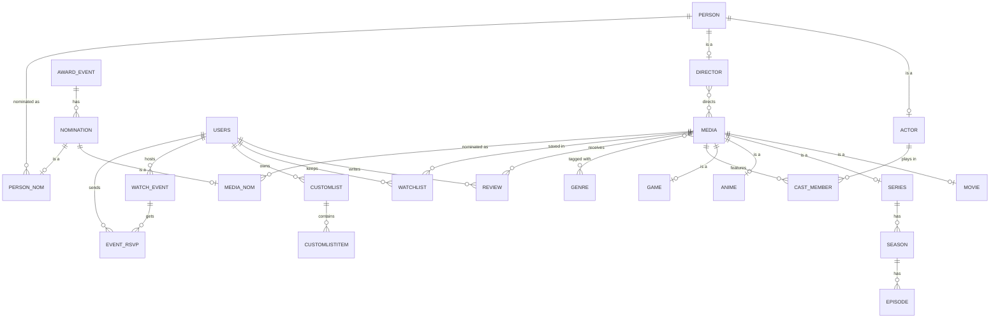

# YellowUmbrella

An IMDb-style site for movies, TV series, anime and games, made as our project for the **CSE 216 Database Sessional** course. It's a FastAPI backend talking to PostgreSQL through hand-written SQL (no ORM), with a plain HTML/JS frontend.

## Team Cells Interlinked

| Name | Student ID |
|---|---|
| Sk. Arib Rajin Shahan | 2305068 |
| Sadman Zaman | 2305075 |



| | |
|---|---|
|  |  |
|  |  |

<p align="center"></p>

## Features

- Browse movies, series, anime and games. Title pages show the synopsis, cast, directors, genres, trailers and box office.
- **Search everything at once**: titles and people from our database, TMDB and RAWG, ranked by how well they match and how well known they are. Suggestions appear as you type, from the search box in the nav bar.
- **Nothing is imported until you click it.** A search result we don't have yet links to `/open/...`, which pulls the full title (cast, trailers and so on) from TMDB or RAWG and then shows its page, so the database only grows with things people actually look at.
- **Cast and crew link to their own pages.** The first time someone's page is opened, their bio and 15 best-known films and shows are pulled from TMDB in the background, so filmographies fill out as people browse.
- **Trending this week** on the home page, live from TMDB and RAWG (cached for an hour, and falls back to our own data if they're unreachable).
- **Top Rated** uses IMDb's weighted-rating formula in SQL, so one 10/10 vote can't put an unknown film above *The Godfather*.
- **Awards**: Oscar nominees in the main categories since 2000, plus winners from the Golden Globes, BAFTA, Cannes and the Emmys, around 1,300 nominations in all, each linked to its film or person.
- Rate titles 1–10 and write reviews. Comment on actor/director pages.
- Watchlist, Favorites and an "Interested" list for games. Lists are private unless you make them public.
- Watch parties: host a screening of a title, others RSVP, and the stream link is only revealed to people who joined.
- Admin panel for managing users, reviews, titles and events.
- Works on phones, and has a password reset by email.

## Database design

The schema is in [`sql/schema.sql`](sql/schema.sql), and the triggers, functions and procedures are in [`sql/functions.sql`](sql/functions.sql). The parts worth looking at:

| Concept | Where |
|---|---|
| ISA hierarchies | `person` → `actor` / `director` · `media` → `movie` / `series` / `anime` / `game` · `nomination` → `media_nom` / `person_nom` |
| Weak entities | `season` and `episode` (identified by their series), `review` (media + user), `trailer`, `customlist` (user + list name) |
| M:N relationships | `cast_member`, `media_director`, `media_genre`, `watchlist`, `event_rsvp`, … |
| Trigger | `rating_trigger` re-blends a title's rating whenever a review is added, changed or removed |
| Functions | `refresh_avg_rating` blends TMDB's votes with ours; `get_top_rated_media` ranks by weighted rating; `get_most_reviewed`; `get_user_stats` |
| Procedures | `register_user`, `add_review` (insert-or-update), `delete_user` |
| Partial unique indexes | TMDB numbers movies and TV separately, so `tmdb_id` is unique per type (`... WHERE mediatype = 'movie'`), not globally |
| Transactions | write routes, and every import, wrap their statements in explicit `BEGIN` / `COMMIT` / `ROLLBACK` |

Two pieces of SQL that do more than they look:

- **Blended rating.** The rating shown on a title counts TMDB's votes and our reviews as one pool:
  `(tmdb_rating × tmdb_votes + Σ our ratings) / (tmdb_votes + number of our reviews)`.
  Three enthusiastic reviews don't overrule 30,000 votes, but on a title TMDB knows nothing about, our reviews are all that counts.
- **Weighted ranking.** Top Rated sorts by `(v·R + m·C) / (v + m)`, where R is the rating, v the votes behind it, C the average rating, and m = 500. Titles with few votes are pulled toward the average, the way IMDb's Top 250 works.



## Tech stack

- **Backend:** Python, FastAPI, pg8000, PyJWT
- **Database:** PostgreSQL
- **Frontend:** HTML and vanilla JavaScript, styled with Tailwind CSS (built ahead of time into one stylesheet) and served by the same FastAPI app
- **Data sources:** [TMDB](https://www.themoviedb.org/) for movies, TV and people, [RAWG](https://rawg.io/) for games, [Wikidata](https://www.wikidata.org/) for award nominations

## Project structure

```
.
├── main.py               # FastAPI app: registers the routers, serves frontend/
├── auth.py               # password hashing, JWTs, "is this your data?" checks
├── database.py           # PostgreSQL connection
├── routes/               # one router per area (movies, reviews, lists, events, admin, ...)
│   └── discover.py       # /search, /discover/trending and /open
├── services/
│   ├── importer.py       # saves a title or person from TMDB / RAWG into our tables
│   └── discover.py       # read-only TMDB / RAWG lookups for search and trending
├── scripts/              # tools for filling the database (see below)
├── sql/
│   ├── schema.sql        # tables, constraints, indexes
│   ├── functions.sql     # triggers, functions, procedures
│   ├── upgrade.sql       # brings a database made from an older schema up to date
│   └── seed.sql          # small sample dataset
└── frontend/             # the HTML pages; statics/ holds app.js, site.css and images
```

## Running it locally

You'll need Python 3.10+ and PostgreSQL 12+.

```bash
git clone https://github.com/SadMan-ZaMaN/Yellow-Umbrella-a-Movie-Database.git
cd Yellow-Umbrella-a-Movie-Database

python -m venv .venv
.venv\Scripts\activate          # Windows
# source .venv/bin/activate     # macOS / Linux
pip install -r requirements.txt
```

Create the database and load the schema:

```bash
createdb -U postgres imdb_project
psql -U postgres -d imdb_project -f sql/schema.sql
psql -U postgres -d imdb_project -f sql/functions.sql
```

Copy `.env.example` to `.env` and fill it in. The database settings and `JWT_SECRET_KEY` are required. The TMDB and RAWG keys are needed for search, trending and the data scripts. SMTP is only needed for password-reset emails.

Then fill the database (next section), or load the small offline sample with `psql -U postgres -d imdb_project -f sql/seed.sql`. Then start the server:

```bash
uvicorn main:app --reload
```

Open http://127.0.0.1:8000 for the site and http://127.0.0.1:8000/docs for the interactive API docs.

To make yourself an admin, sign up on the site and then run:

```sql
UPDATE users SET role = 'admin' WHERE username = 'your_username';
```

Already have a database from an older version of this project? Run `sql/upgrade.sql` and then `sql/functions.sql` on it, followed by `python -m scripts.backfill_catalog`.

## Filling the database

Run these from the project root:

```bash
python -m scripts.import_popular     # ~300 well-known movies, shows, anime and games (a couple of minutes)
python -m scripts.import_awards      # award nominations from Wikidata, plus every nominee
```

| Script | What it does |
|---|---|
| `import_popular` | The most-voted movies and shows on TMDB, the most popular anime, and the games most people own on RAWG. Skips anything already imported. |
| `import_awards` | Rebuilds the award tables from Wikidata (`--since 2015` for fewer years). **Replaces existing nominations.** |
| `backfill_catalog` | Matches every existing title to TMDB / RAWG and refreshes its ids, images, synopsis, rating and vote count. |
| `prune_obscure` | Lists titles with almost no votes that nobody has reviewed, listed or nominated. `--apply` deletes them. |
| `add_nominations` | Adds nominations by hand (edit the lists at the top of the file). |

The stylesheet is already built. If you change the styling or add Tailwind classes to a page, rebuild it with `npm install` once, then `npm run build:css`.

## Privacy and security

- Every route that reads or changes a user's data gets the user from the signed JWT and compares it against the id in the URL or request body. An earlier version trusted the id the browser sent, which meant anyone could open devtools, change `userid` in localStorage and edit or read someone else's lists. That's fixed. Private lists now return 404 to anyone but their owner (or an admin).
- Admin rights are checked against the database on each request, so demoting someone takes effect immediately.
- Passwords are stored as salted PBKDF2-SHA256. Accounts from before that change still log in and are upgraded automatically on their next login.
- User-written text (reviews, comments, usernames, event titles) is HTML-escaped before it's put on the page.

Film, TV and people data comes from TMDB, and this project isn't endorsed or certified by TMDB. Game data comes from RAWG, and award data from Wikidata.
