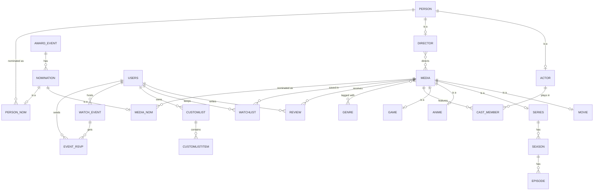

# YellowUmbrella

An IMDb-style site for movies, TV series, anime and games. Built as the term project for **CSE 216 (Database Systems)**: a FastAPI backend talking to PostgreSQL through hand-written SQL (no ORM), with a plain HTML/JS frontend.


## Features

- Browse movies, series, anime and games. Title pages show cast, directors, genres, trailers and box office.
- Search pulls in anything that's missing. If a title isn't in the database yet, it's fetched from TMDB (or RAWG for games) and saved, so the catalogue grows as people use it.
- Rate titles 1–10 and write reviews. Comment on actor/director pages.
- Watchlist, Favorites and an "Interested" list for games. Lists are private unless you make them public.
- Watch parties: host a screening of a title, others RSVP, and the stream link is only revealed to people who joined.
- Award history for the Oscars, Golden Globes, BAFTA, Cannes and the Emmys, by year and category.
- Admin panel for managing users, reviews, titles and events.
- Password reset by email.

## Database design

The schema is in [`sql/schema.sql`](sql/schema.sql), and the trigger, functions and procedures are in [`sql/functions.sql`](sql/functions.sql). The parts worth looking at:

| Concept | Where |
|---|---|
| ISA hierarchies | `person` → `actor` / `director` · `media` → `movie` / `series` / `anime` / `game` · `nomination` → `media_nom` / `person_nom` |
| Weak entities | `season` and `episode` (identified by their series), `review` (media + user), `trailer`, `customlist` (user + list name) |
| M:N relationships | `cast_member`, `media_director`, `media_genre`, `watchlist`, `event_rsvp`, … |
| Trigger | `rating_trigger` recalculates `media.avgrating` on every review insert, update or delete |
| Functions | `get_top_rated_media`, `get_most_reviewed`, `get_user_stats`, all used by the `/stats` endpoints |
| Procedures | `register_user`, `add_review` (insert-or-update), `delete_user` |
| Transactions | write routes wrap their statements in explicit `BEGIN` / `COMMIT` / `ROLLBACK` |



## Tech stack

- **Backend:** Python, FastAPI, pg8000, PyJWT
- **Database:** PostgreSQL
- **Frontend:** HTML, vanilla JavaScript and Tailwind (via CDN), served by the same FastAPI app
- **Data sources:** [TMDB](https://www.themoviedb.org/) for movies, TV and people, [RAWG](https://rawg.io/) for games

## Project structure

```
.
├── main.py              # FastAPI app: registers the routers, serves frontend/
├── auth.py              # password hashing, JWTs, "is this your data?" checks
├── database.py          # PostgreSQL connection
├── routes/              # one router per area (movies, reviews, lists, events, admin, ...)
├── services/
│   └── importer.py      # fetches a title/person from TMDB or RAWG and saves it
├── scripts/             # one-off tools for filling the database (see below)
├── sql/
│   ├── schema.sql       # tables, constraints, indexes
│   ├── functions.sql    # trigger, functions, procedures
│   └── seed.sql         # small sample dataset
└── frontend/            # the HTML pages, plus statics/ for JS, CSS and images
```

## Running it locally

You'll need Python 3.10+ and PostgreSQL 12+.

```bash
git clone https://github.com/<your-username>/YellowUmbrella.git
cd YellowUmbrella

python -m venv .venv
.venv\Scripts\activate          # Windows
# source .venv/bin/activate     # macOS / Linux
pip install -r requirements.txt
```

Create the database and load the schema:

```bash
createdb -U postgres imdb_project
psql -U postgres -d imdb_project -f sql/schema.sql
psql -U postgres -d imdb_project -f sql/functions.sql
psql -U postgres -d imdb_project -f sql/seed.sql      # optional: small sample dataset
```

Copy `.env.example` to `.env` and fill it in. The database settings and `JWT_SECRET_KEY` are required. The TMDB and RAWG keys are only needed for search-import and the data scripts. SMTP is only needed for password-reset emails.

```bash
uvicorn main:app --reload
```

Open http://127.0.0.1:8000 for the site and http://127.0.0.1:8000/docs for the interactive API docs.

To make yourself an admin, sign up on the site and then run:

```sql
UPDATE users SET role = 'admin' WHERE username = 'your_username';
```

## Filling the database

`seed.sql` gives you a handful of titles to click around with. For real data, run these from the project root, after setting `TMDB_TOKEN` and `RAWG_KEY` in `.env`:

```bash
python -m scripts.import_tmdb      # ~140 popular movies, series and anime
python -m scripts.import_games     # popular games from RAWG
python -m scripts.seed_awards      # award shows, categories and nominees
```

| Script | What it does |
|---|---|
| `import_tmdb` | Bulk import of popular movies, series and anime |
| `import_games` | Bulk import of popular games from RAWG |
| `import_by_name` | Interactive: search TMDB for one title and import it |
| `seed_complete` | The larger seeder used for the demo: backfills existing rows and adds a curated set of titles |
| `seed_awards` | Rebuilds all award data. **Wipes existing nominations first** |
| `add_directors`, `add_nominations` | Add Best Director nominations / add nominations by hand |
| `fix_subtitles_posters` | One-off patch to the award data (role subtitles, BAFTA nominees). Run after `seed_awards` |
| `backfill_*` | Fill in missing ratings, trailers, people info, or cast/crew |
| `fix_posters`, `fix_person_photos` | Re-search TMDB for broken or missing images |
| `clean_and_import` | **Wipes** media, people and awards, then imports trending titles |

## Privacy and security

- Every route that reads or changes a user's data gets the user from the signed JWT and compares it against the id in the URL or request body. An earlier version trusted the id the browser sent, which meant anyone could open devtools, change `userid` in localStorage and edit or read someone else's lists. That's fixed. Private lists now return 404 to anyone but their owner (or an admin).
- Admin rights are checked against the database on each request, so demoting someone takes effect immediately.
- Passwords are stored as salted PBKDF2-SHA256. Accounts from before that change still log in and are upgraded automatically on their next login.
- User-written text (reviews, comments, usernames, event titles) is HTML-escaped before it's put on the page.
