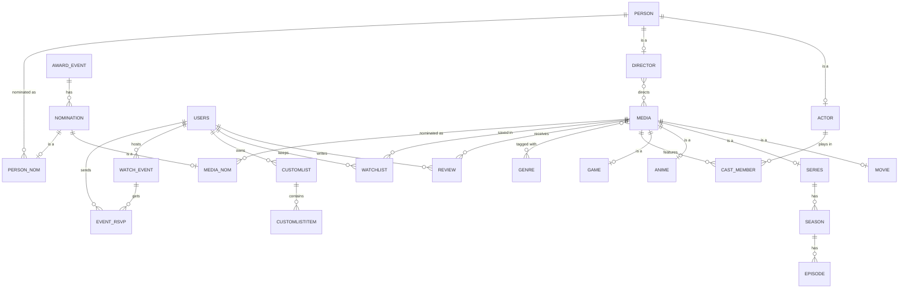

# YellowUmbrella

An IMDb-style site for movies, TV series, anime and games, made as our project for the **CSE 216 Database Sessional** course. It's a FastAPI backend talking to PostgreSQL through hand-written SQL (no ORM), with a plain HTML/JS frontend.

## Team Cells Interlinked

| Name | Student ID |
|---|---|
| Sk. Arib Rajin Shahan | 2305068 |
| Sadman Zaman | 2305075 |


| | |
|---|---|
|  |  |
|  |  |

<p align="center"></p>

## Features

- Browse movies, series, anime and games. Title pages show the synopsis, cast, directors, genres, trailers and box office.
- **Search everything at once**: titles and people from our database, TMDB and RAWG, ranked by how well they match and how well known they are. Suggestions appear as you type, from the search box in the nav bar.
- **Nothing is imported until you click it.** A search result we don't have yet links to `/open/...`, which pulls the full title (cast, trailers and so on) from TMDB or RAWG and then shows its page, so the database only grows with things people actually look at.
- **Cast and crew link to their own pages.** The first time someone's page is opened, their bio and 15 best-known films and shows are pulled from TMDB in the background, so filmographies fill out as people browse.
- **Trending this week** on the home page, live from TMDB and RAWG (cached for an hour, and falls back to our own data if they're unreachable).
- **Top Rated** uses IMDb's weighted-rating formula in SQL, so one 10/10 vote can't put an unknown film above *The Godfather*.
- **Awards**: Oscar nominees in the main categories since 2000, plus winners from the Golden Globes, BAFTA, Cannes and the Emmys, around 1,300 nominations in all, each linked to its film or person.
- Rate titles 1–10 and write reviews. Comment on actor/director pages.
- Watchlist, Favorites and an "Interested" list for games. Lists are private unless you make them public.
- Watch parties: host a screening of a title, others RSVP, and the stream link is only revealed to people who joined.
- Admin panel for managing users, reviews, titles and events.
- Works on phones, and has a password reset by email.

## Database design

The schema is in [`sql/schema.sql`](sql/schema.sql), and the triggers, functions and procedures are in [`sql/functions.sql`](sql/functions.sql). The parts worth looking at:

| Concept | Where |
|---|---|
| ISA hierarchies | `person` → `actor` / `director` · `media` → `movie` / `series` / `anime` / `game` · `nomination` → `media_nom` / `person_nom` |
| Weak entities | `season` and `episode` (identified by their series), `review` (media + user), `trailer`, `customlist` (user + list name) |
| M:N relationships | `cast_member`, `media_director`, `media_genre`, `watchlist`, `event_rsvp`, … |
| Trigger | `rating_trigger` re-blends a title's rating whenever a review is added, changed or removed |
| Functions | `refresh_avg_rating` blends TMDB's votes with ours; `get_top_rated_media` ranks by weighted rating; `get_most_reviewed`; `get_user_stats` |
| Procedures | `register_user`, `add_review` (insert-or-update), `delete_user` |
| Partial unique indexes | TMDB numbers movies and TV separately, so `tmdb_id` is unique per type (`... WHERE mediatype = 'movie'`), not globally |
| Transactions | write routes, and every import, wrap their statements in explicit `BEGIN` / `COMMIT` / `ROLLBACK` |

Two pieces of SQL that do more than they look:

- **Blended rating.** The rating shown on a title counts TMDB's votes and our reviews as one pool:
  `(tmdb_rating × tmdb_votes + Σ our ratings) / (tmdb_votes + number of our reviews)`.
  Three enthusiastic reviews don't overrule 30,000 votes, but on a title TMDB knows nothing about, our reviews are all that counts.
- **Weighted ranking.** Top Rated sorts by `(v·R + m·C) / (v + m)`, where R is the rating, v the votes behind it, C the average rating, and m = 500. Titles with few votes are pulled toward the average, the way IMDb's Top 250 works.



## Tech stack

- **Backend:** Python, FastAPI, pg8000, PyJWT
- **Database:** PostgreSQL
- **Frontend:** HTML and vanilla JavaScript, styled with Tailwind CSS (built ahead of time into one stylesheet) and served by the same FastAPI app
- **Data sources:** [TMDB](https://www.themoviedb.org/) for movies, TV and people, [RAWG](https://rawg.io/) for games, [Wikidata](https://www.wikidata.org/) for award nominations

## Project structure

```
.
├── main.py               # FastAPI app: registers the routers, serves frontend/
├── auth.py               # password hashing, JWTs, "is this your data?" checks
├── database.py           # PostgreSQL connection
├── routes/               # one router per area (movies, reviews, lists, events, admin, ...)
│   └── discover.py       # /search, /discover/trending and /open
├── services/
│   ├── importer.py       # saves a title or person from TMDB / RAWG into our tables
│   └── discover.py       # read-only TMDB / RAWG lookups for search and trending
├── scripts/              # tools for filling the database (see below)
├── sql/
│   ├── schema.sql        # tables, constraints, indexes
│   ├── functions.sql     # triggers, functions, procedures
│   ├── upgrade.sql       # brings a database made from an older schema up to date
│   └── seed.sql          # small sample dataset
└── frontend/             # the HTML pages; statics/ holds app.js, site.css and images
```

## Getting started

Setting it up takes about 15 minutes the first time, mostly installing things and waiting for data to download. The commands below are for **Windows**; macOS / Linux versions are shown next to them where they differ.

### 1. Install the prerequisites

| What | Where | Notes |
|---|---|---|
| Git | https://git-scm.com/downloads | |
| Python 3.10 or newer | https://www.python.org/downloads/ | On Windows, tick **"Add python.exe to PATH"** in the installer. |
| PostgreSQL 12 or newer | https://www.postgresql.org/download/ | The installer asks for a password for the `postgres` user. **Remember it**, you'll need it in step 4. Keep the default port, 5432. |

You don't need Node.js. It's only used to rebuild the stylesheet, which is already built.

### 2. Get the two free API keys

The site gets its movies, shows and people from TMDB and its games from RAWG.

**TMDB** (movies, TV, anime, people)
1. Make an account at https://www.themoviedb.org/signup and verify your email.
2. Go to **Settings → API** (https://www.themoviedb.org/settings/api) and request an API key. Pick "Developer". For the application URL, `http://localhost:8000` is fine.
3. Copy the **API Read Access Token**, the long one that starts with `eyJ`, not the shorter "API Key".

**RAWG** (games)
1. Make an account at https://rawg.io/signup.
2. Open https://rawg.io/apidocs, click **Get API Key**, fill in the short form and copy the key.

### 3. Download the code and install the Python packages

```bash
git clone https://github.com/SadMan-ZaMaN/Yellow-Umbrella-a-Movie-Database.git
cd Yellow-Umbrella-a-Movie-Database

python -m venv .venv
.venv\Scripts\activate                 # macOS / Linux: source .venv/bin/activate
python -m pip install -r requirements.txt
```

Once the virtual environment is active, your prompt starts with `(.venv)`. Every command below assumes it's active.

### 4. Put your settings in `.env`

```bash
copy .env.example .env                 # macOS / Linux: cp .env.example .env
```

Open `.env` in any text editor and fill in:

| Setting | What to put |
|---|---|
| `DB_PASSWORD` | the PostgreSQL password from step 1 |
| `JWT_SECRET_KEY` | any long random string. Generate one with `python -c "import secrets; print(secrets.token_urlsafe(32))"` |
| `TMDB_TOKEN` | the TMDB API Read Access Token from step 2 |
| `RAWG_KEY` | the RAWG key from step 2 |

Leave the other database settings as they are unless you changed them while installing PostgreSQL. The `SMTP_*` settings are optional, and only needed for password-reset emails (with Gmail, use an [App Password](https://support.google.com/accounts/answer/185833), not your normal one).

A filled-in `.env` looks like this (these values are made up):

```env
DB_NAME=imdb_project
DB_USER=postgres
DB_PASSWORD=mypostgrespassword
DB_HOST=localhost
DB_PORT=5432
JWT_SECRET_KEY=Qe8x2Lr0yN4m9TzV1cKpA7sWd3fGh6Jb
TMDB_TOKEN=eyJhbGciOiJIUzI1NiJ9.eyJhdWQiOi...
RAWG_KEY=0123456789abcdef0123456789abcdef
```

`.env` is in `.gitignore`, so your keys never end up on GitHub.

### 5. Create the database

```bash
python -m scripts.setup_db
```

This creates the `imdb_project` database and all its tables, triggers and functions.

### 6. Fill it with movies, shows, games and awards

```bash
python -m scripts.import_popular       # ~300 well-known titles, about 2 minutes
python -m scripts.import_awards        # ~1,300 award nominations from Wikidata, about 2 minutes
```

The site also adds titles by itself as you use it: anything you search for and open gets saved. No API keys yet? `python -m scripts.setup_db --sample` (on a new, empty database) loads a small offline sample instead.

### 7. Start the site

```bash
python -m uvicorn main:app --reload
```

Open **http://127.0.0.1:8000**. The interactive API docs are at http://127.0.0.1:8000/docs. Stop the server with `Ctrl+C`.

### 8. (Optional) Make yourself an admin

Sign up on the site, then:

```bash
python -m scripts.make_admin your_username
```

Reload the page and an **Admin** link appears in the nav.

### Next time

You only need to start the server again:

```bash
cd Yellow-Umbrella-a-Movie-Database
.venv\Scripts\activate                 # macOS / Linux: source .venv/bin/activate
python -m uvicorn main:app --reload
```

To update after pulling new code, run `python -m scripts.setup_db` again. On an existing database it applies any schema changes without touching your data.

### If something goes wrong

| Problem | Fix |
|---|---|
| `python` is not recognized | Python isn't on your PATH. Reinstall it with "Add python.exe to PATH" ticked, or use `py` instead of `python`. |
| `Activate.ps1 cannot be loaded because running scripts is disabled` (PowerShell) | Run `Set-ExecutionPolicy -Scope CurrentUser RemoteSigned` once, or use Command Prompt instead. |
| `password authentication failed for user "postgres"` | `DB_PASSWORD` in `.env` doesn't match the one you set when installing PostgreSQL. |
| `Couldn't connect to PostgreSQL` / connection refused | PostgreSQL isn't running. On Windows, start the "postgresql" service from the Services app. |
| Search finds nothing new / the home page has no trending titles | `TMDB_TOKEN` or `RAWG_KEY` is missing or wrong. Restart the server after fixing `.env`. |
| You get logged out every time the server restarts | `JWT_SECRET_KEY` is empty in `.env`. |
| `address already in use` | Something else is on port 8000. Use `python -m uvicorn main:app --reload --port 8001` and open http://127.0.0.1:8001. |

## Data scripts

All of these run from the project folder with the virtual environment active, as `python -m scripts.<name>`.

| Script | What it does |
|---|---|
| `setup_db` | Creates the database and loads the schema, or updates an existing one. `--sample` adds a small offline dataset. |
| `make_admin <username>` | Gives an account admin rights. |
| `import_popular` | The most-voted movies and shows on TMDB, the most popular anime, and the games most people own on RAWG. Skips anything already imported. |
| `import_awards` | Rebuilds the award tables from Wikidata (`--since 2015` for fewer years). **Replaces existing nominations.** |
| `backfill_catalog` | Matches every existing title to TMDB / RAWG and refreshes its ids, images, synopsis, rating and vote count. |
| `prune_obscure` | Lists titles with almost no votes that nobody has reviewed, listed or nominated. `--apply` deletes them. |
| `add_nominations` | Adds nominations by hand (edit the lists at the top of the file). |

The stylesheet is already built. If you change the styling or add Tailwind classes to a page, rebuild it with [Node.js](https://nodejs.org/): `npm install` once, then `npm run build:css`.

## Privacy and security

- Every route that reads or changes a user's data gets the user from the signed JWT and compares it against the id in the URL or request body. An earlier version trusted the id the browser sent, which meant anyone could open devtools, change `userid` in localStorage and edit or read someone else's lists. That's fixed. Private lists now return 404 to anyone but their owner (or an admin).
- Admin rights are checked against the database on each request, so demoting someone takes effect immediately.
- Passwords are stored as salted PBKDF2-SHA256. Accounts from before that change still log in and are upgraded automatically on their next login.
- User-written text (reviews, comments, usernames, event titles) is HTML-escaped before it's put on the page.

Film, TV and people data comes from TMDB, and this project isn't endorsed or certified by TMDB. Game data comes from RAWG, and award data from Wikidata.
